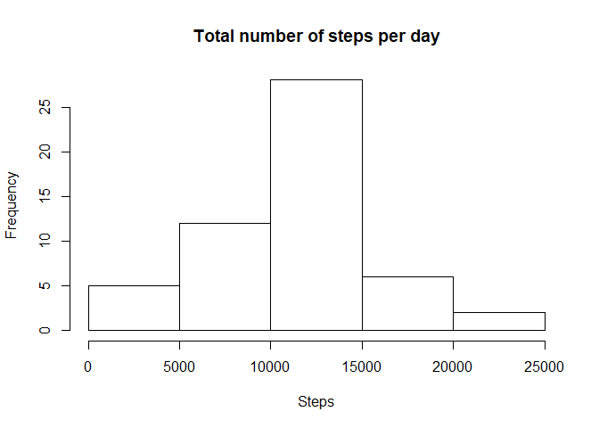
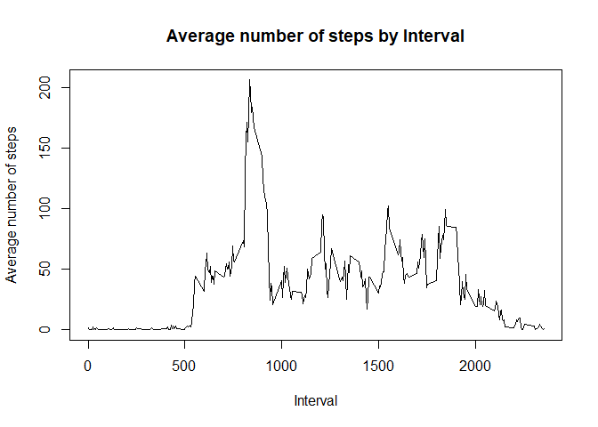
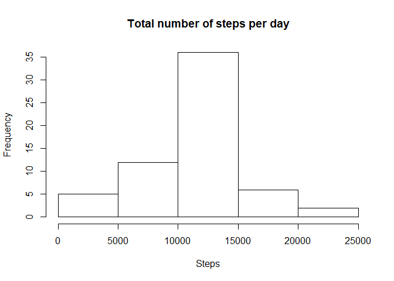

## Loading and preprocessing the data
Code for reading in the dataset and/or processing the data

1. Load the data (i.e. read.csv())


```r
actData <- read.csv("activity.csv", as.is = TRUE)
head(actData)
```

```
##   steps       date interval
## 1    NA 2012-10-01        0
## 2    NA 2012-10-01        5
## 3    NA 2012-10-01       10
## 4    NA 2012-10-01       15
## 5    NA 2012-10-01       20
## 6    NA 2012-10-01       25
```


## What is mean total number of steps taken per day?
Histogram of the total number of steps taken each day

1. Calculate the total number of steps taken per day


```r
stepsPerDay <- aggregate(steps ~ date, data = actData, sum, na.rm=TRUE)
```
2. If you do not understand the difference between a histogram and a barplot, research the difference between them. Make a histogram of the total number of steps taken each day

```r
hist(aggregate(steps ~ date, data = stepsPerDay, sum, na.rm=TRUE)$steps, main="Total number of steps per day", xlab="Steps")
```

<!-- -->

3. Mean total number of steps taken per day

```r
mean(stepsPerDay$steps, na.rm = TRUE)
```

```
## [1] 10766.19
```
4. Median total number of steps taken per day


```r
median(stepsPerDay$steps, na.rm = TRUE)
```

```
## [1] 10765
```
## What is the average daily activity pattern?
1. Time series plot (i.e. type = “l”) of the 5-minute interval (x-axis) and the average number of steps taken, averaged across all days (y-axis)

```r
stepsPerInterval <- aggregate(steps ~ interval, data = actData, mean, na.rm=TRUE)
```

```r
plot(stepsPerInterval$interval, stepsPerInterval$steps, type='l', main="Average number of steps by Interval", 
     xlab="Interval", ylab="Average number of steps")
```

<!-- -->

2. Which 5-minute interval, on average across all the days in the dataset, contains the maximum number of steps?

```r
stepsPerInterval[which.max(stepsPerInterval$steps), "interval"]
```

```
## [1] 835
```

## Imputing missing values

1. Calculate and report the total number of missing values in the dataset (i.e. the total number of rows with NAs)

```r
nrow(actData[is.na(actData$steps),])
```

```
## [1] 2304
```

2. Devise a strategy for filling in all of the missing values in the dataset. The strategy does not need to be sophisticated.


```r
# Create tmp DS with addtional column with mean of steps by interval
tmp <- merge(actData, aggregate(steps ~ interval, data = actData, mean, na.rm=TRUE), by=c("interval"))
```


```r
# then rewrite NAs in steps (steps.x) with mean by interval (steps.y) and rename column with steps
tmp[is.na(tmp$steps.x),"steps.x"] <- tmp[is.na(tmp$steps.x),"steps.y"]
names(tmp)[names(tmp) == "steps.x"] <- "steps"
```

3. Create a new dataset that is equal to the original dataset but with the missing data filled in.


```r
newDS <- tmp[,c("steps","date","interval")]
```

4. Make a histogram of the total number of steps taken each day and Calculate and report the mean and median total number of steps taken per day.

```r
#Get total Steps from imputed data
stepsDayClean <- aggregate(steps ~ date, data = newDS, sum, na.rm=TRUE)
hist(aggregate(steps ~ date, data = stepsDayClean, sum, na.rm=TRUE)$steps, 
     main="Total number of steps per day", xlab="Steps")
```

<!-- -->

## Are there differences in activity patterns between weekdays and weekends?
1. Create a new factor variable in the dataset with two levels – “weekday” and “weekend” indicating whether a given date is a weekday or weekend day.


```r
newDS$dow <- weekdays(as.Date(newDS$date, "%Y-%m-%d"))
newDS$type <- ifelse(newDS$dow %in% c("Saturday","Sunday"),"weekend","weekday")
```

2. Make a panel plot containing a time series plot (i.e. type = “l”) of the 5-minute interval (x-axis) and the average number of steps taken, averaged across all weekday days or weekend days (y-axis).


```r
#Average by Interval and Date Type (Weekday and Weekend)

avgType <- aggregate(steps ~ interval + type, newDS, mean)
xyplot(avgType$steps~avgType$interval|avgType$type,layout=(c(1,2)),type="l",xlab="Interval", ylab="Number of steps")
```

<!-- -->
